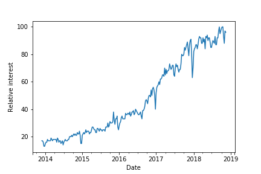

### Medium Classifier
Capstone project for Udacity's ML Engineer Nanodegree

### Setup

Run `conda env create -f env.yml` from the root folder of this directory.

Use `conda env create -f env-fastai.yml` if you want to install pytorch and fastai as well.

Instructions on where to obtain the data as well as other required resources can be found in the report and notebooks.

### Project Overview
This project evaluates the use of machine learning to tackle the omnipresent problem of [information overload](https://en.wikipedia.org/wiki/Information_overload).
In particular, it targets the ever growing amount of textual information on the web in the form of blog posts.
Blog posts can be a great source of information on a wide variety of specialized topics. They are commonly more accessible than books
and many provide practical insights from experts free of charge. However, there is a large spread in quality between well-written, informative and low quality "clickbait" posts ([Gardiner, 2015](https://www.wired.com/2015/12/psychology-of-clickbait/)). Especially in "hot" fields, many authors try to benefit from the hype by putting out posts with catchy titles to impress newcomers and gather clicks without sharing any insightful content.

One of these is the field of machine learning itself. This area has received increasing attention in recent years (compare Figure 1). As a consequence, the topic is covered extensively in both popular media and by technical writers.

*Interest in machine learning as measured by Google Trends*
 
 

While this growing interest has certainly fueled investment in promising technologies powered by machine learning, it also makes it harder to separate the signal from the noise. The remainder of this report details an approach that leverages machine learning to tackle this problem. To do so, a system is developed that automatically suggests whether or not the user will find a particular machine learning blog post interesting based on the post's text.

### Problem Statement
In order to delineate well-defined objectives and benchmarks, the problem space is narrowed down by imposing three central restrictions:

1. The focus is on machine learning blog posts published at [medium.com](https://medium.com/).
2. These posts are grouped in two categories: "Interesting" and "Not interesting". These will be what machine learning is used to differentiate between. The machine learning task will therefore be *binary classification*.
3. The definition of "interesting" and the prioritization of the two types of error a binary classification model can make (1. Cluttering the results by wrongly predicting an uninteresting post to be interesting vs. 2. missing an interesting post by wrongly predicting it as uninteresting) is done based on the authors preferences (see section on *Metrics* below).

Of course, restriction 3) does not imply that the approach is only relevant to the authors preferences. The general framework can be tailored to anyone by substituting the input labels and adjusting the metric prioritization based on their liking.

To illustrate this, compare an exemplary problem statement tailored to the author:

> I love to read blog posts on machine learning (ML) and artificial intelligence (AI) on medium.com, a popular online publishing platform. However, not all of the articles available there fit my taste. Unfortunately, I sometimes find this only after having read the article. In particular, I do not enjoy articles which are superficial and aim to benefit from the hype around ML and AI, thereby confusing beginners. On the other hand, I enjoy articles offering a deep coverage of technical concepts and are written in a way that keeps the reader engaged nevertheless. As I am always short on time, I am particularly interested in a solution that reliably identifies blog posts that I will really enjoy as interesting to me and would be willing to sacrifice a few articles that I might have liked, but which the model misses.

For more information, please refer to the final report.
