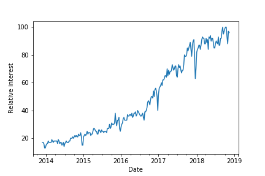

# Machine Learning Engineer Nanodegree
## Capstone Project
Steffen Bunzel
January 6th, 2019

## I. Definition

### Project Overview
This project evaluates the use of machine learning to tackle the omnipresent problem of [information overload](https://en.wikipedia.org/wiki/Information_overload).
In particular, it targets the ever growing amount of textual information on the web in the form of blog posts.
Blog posts can be a great source of information on a wide variety of specialized topics. They are commonly more accessible than books
and many provide practical insights from experts free of charge. However, there is a large spread in quality between well-written, informative and low quality "clickbait" posts ([Gardiner, 2015](https://www.wired.com/2015/12/psychology-of-clickbait/)). Especially in "hot" fields, many authors try to benefit from the hype by putting out posts with catchy titles to impress newcomers and gather clicks without sharing any insightful content.

One of these is the field of machine learning itself. This area has received increasing attention in recent years (compare Figure 1). As a consequence, the topic is covered extensively in both popular media and by technical writers.

<center></center>
<center>*Figure 1: Interest in machine learning as measured by Google Trends*
<br>
<br>
</center>

While this growing interest has certainly fueled investment in promising technologies powered by machine learning, it also makes it harder to separate the signal from the noise. The remainder of this report details an approach that leverages machine learning to tackle this problem. To do so, a system is developed that automatically suggests whether or not the user will find a particular machine learning blog post interesting based on the post's text.

### Problem Statement
In order to delineate well-defined objectives and benchmarks, the problem space is narrowed down by imposing three central restrictions:

1. The focus is on machine learning blog posts published at [medium.com](https://medium.com/).
2. These posts are grouped in two categories: "Interesting" and "Not interesting". These will be what machine learning is used to differentiate between. The machine learning task will therefore be *binary classification*.
3. The definition of "interesting" and the prioritization of the two types of error a binary classification model can make (1. Cluttering the results by wrongly predicting an uninteresting post to be interesting vs. 2. missing an interesting post by wrongly predicting it as uninteresting) is done based on the authors preferences (see section on *Metrics* below).

Of course, restriction 3) does not imply that the approach is only relevant to the authors preferences. The general framework can be tailored to anyone by substituting the input labels and adjusting the metric prioritization based on their liking.

To illustrate this, compare an exemplary problem statement tailored to the author:

> I love to read blog posts on machine learning (ML) and artificial intelligence (AI) on medium.com, a popular online publishing platform. However, not all of the articles available there fit my taste. Unfortunately, I sometimes find this only after having read the article. In particular, I do not enjoy articles which are superficial and aim to benefit from the hype around ML and AI, thereby confusing beginners. On the other hand, I enjoy articles offering a deep coverage of technical concepts and are written in a way that keeps the reader engaged nevertheless. As I am always short on time, I am particularly interested in a solution that reliably identifies blog posts that I will really enjoy as interesting to me and would be willing to sacrifice a few articles that I might have liked, but which the model misses.

### Metrics
The metrics that will be used to assess the classifier's performance need to balance two aspects: The user has limited capacity to read blog posts and wants to find the ones they are interested in with high precision. Thus, the first metric employed is precision:

`precision = true positives / (true positives + false positives)`

Based on the author's problem statement above, a **target precision of 95%** will serve as a guideline for this project, which means that only one in twenty posts recommended by the classifier are actually uninteresting.

On the other hand, the number of article recommendations should not be restricted too much. Therefore, the model's ability to identify a substantial share of the actually interesting posts as such must be taken into consideration as well. This objective is covered by the `recall` metric. As the author prioritizes precision over recall, the objective for this metric is set to a **recall of 75%**, which means that only one in four interesting posts are classified as not interesting:

`recall = true positives / (true positives + false negatives)`

## II. Analysis

### Data Exploration
To tackle this problem, a dataset of ML blog posts published on medium.com is needed.
Luckily, a Kaggle user has already provided a collection of such data on the [platform](https://www.kaggle.com/hsankesara/medium-articles/home). This dataset was scraped from medium.com and made available under the `CC0: Public Domain license, i.e. as a work in the public domain without copyright` license. The dataset contains the post's author, its estimated reading time, a link to the post, its title, its text body as well as the number of claps (a form of like) it has received to date.

While the raw data contained 337 rows, it included several duplicates, resulting in 230 unique articles. Of these, six were not written in English, thus reducing the number to 224. To keep the requirements with respect to provisions from the user manageable, the top 130 posts based on their number of claps were labeled as either "interesting" or "uninteresting" by the author after manually assessing each post on medium.com for 2-5 minutes.

Thus, the data contains 130 observations of 5 potential features (ignoring the link to the article) and one target variable ("interesting" or "uninteresting"). Two of these features are numerical: Claps and reading time.

<center>
<table border="2" class="dataframe">
  <thead>
    <tr style="text-align: center;">
      <th><center></th>
      <th><center>claps</th>
      <th><center>reading_time</th>
    </tr>
  </thead>
  <tbody>
    <tr align="center">
      <th><center>count</th>
      <td>130.00</td>
      <td>130.00</td>
    </tr>
    <tr align="center">
      <th><center>mean</th>
      <td>7064.05</td>
      <td>10.67</td>
    </tr>
    <tr align="center">
      <th><center>std</th>
      <td>9836.08</td>
      <td>5.61</td>
    </tr>
    <tr align="center">
      <th><center>min</th>
      <td>10.00</td>
      <td>3.00</td>
    </tr>
    <tr align="center">
      <th><center>25%</th>
      <td>1500.00</td>
      <td>7.00</td>
    </tr>
    <tr align="center">
      <th><center>50%</th>
      <td>3300.00</td>
      <td>9.00</td>
    </tr>
    <tr align="center">
      <th><center>75%</th>
      <td>8450.00</td>
      <td>13.00</td>
    </tr>
    <tr align="center">
      <th><center>max</th>
      <td>53000.00</td>
      <td>31.00</td>
    </tr>
  </tbody>
</table>
</center>
<center>
*Table 1: Summary statistics on the numerical features*
<br>
<br>
</center>

The other columns all contain non-numeric values and are almost always unique.
<center>
<table border="2" class="dataframe">
  <thead>
    <tr style="text-align: center;">
      <th><center></th>
      <th><center>author</th>
      <th><center>title</th>
      <th><center>text</th>
    </tr>
  </thead>
  <tbody>
    <tr align="center">
      <th><center>count</th>
      <td>130</td>
      <td>130</td>
      <td>130</td>
    </tr>
    <tr align="center">
      <th><center>unique</th>
      <td>102</td>
      <td>130</td>
      <td>130</td>
    </tr>
    <tr align="center">
      <th><center>top</th>
      <td>Adam Geitgey</td>
      <td>Distributed Neural Networks with GPUs in the A...</td>
      <td>What Machine Learning Teaches Us About Ourselv...</td>
    </tr>
    <tr align="center">
      <th><center>freq</th>
      <td>6</td>
      <td>1</td>
      <td>1</td>
    </tr>
  </tbody>
</table>
</center>
<center>
*Table 2: Summary statistics on the non-numerical features*
<br>
<br>
</center>

These basic statistics show that the data underlying this project has a simple structure: It consists of the contents of a blog post (represented by its title and text body) as well as three pieces of metadata (the post's author, the number of claps and the estimated reading time).

As mentioned above, the target variable of this dataset is whether the author found the particular article interesting or not after assessing it manually for 2-5 minutes. This variable is binary: It is 0 for posts the author found uninteresting and 1 for posts he found interesting. The distribution of the classes is slightly imbalanced: Approximately 35% of the posts are labeled "interesting" while the remaining 65% are labeled "uninteresting".

### Exploratory Visualization

Arguably the simplest approach to solving this problem with machine learning would be to focus on the numerical columns only, i.e. build a classification model based on number of claps and reading time. One advantage of this approach is that due to the feature space having just two dimensions, the separability of the two classes can be visually assessed.

<center></center>
<center>*Figure 2: Classes by claps and reading time*
<br>
<br>
</center>

Figure 2 shows all posts in the data set in a scatterplot of claps and reading time. The articles labeled "interesting" are marked green, while the articles labeled "not interesting" are colored in orange. The illustration shows two main things:

1. The data is not easily separated linearly.
2. A clear non-linear separation is not obvious either.

These two characteristics underline the need to evaluate alternatives to using metadata to distinguish interesting from uninteresting articles.

### Algorithms and Techniques
As the focus of this work is on using just a post's text as an input for a classification task, the potential algorithmic approaches vary greatly depending on the approach used for pre-processing the data. The approaches evaluated in this project can be differentiated in three categories:

1. Transforming the text into a numerical matrix based on word counts (absolute counts or relative to the frequency across all documents) allows training an arbitrary machine learning model. In particular three standard model classes were evaluated: A random forest classifier, a gradient boosting classifier and a support vector machine classifier.
2. The second class of approaches aims to equip the model with a form of prior knowledge in the form of pretrained word embeddings, i.e. numerical vectors that represent each word and are derived from general purpose corpora in an unsupervised manner. While they could theoretically be used with a variety of modeling approaches, using word embeddings in combination with neural networks has recently become popular. In particular, this work evaluates approaches showcased in a [current Kaggle competition on text classification](https://www.kaggle.com/c/quora-insincere-questions-classification) and makes use of the [GloVe word embeddings](https://nlp.stanford.edu/projects/glove/) from Stanford NLP.
3. Going one step further, a third class of approaches, popularized through works like fast.ai's [ULMFiT](https://arxiv.org/abs/1801.06146) or Google's [BERT](https://arxiv.org/abs/1810.04805) in 2018, encodes prior knowledge not "merely" through word embeddings, but pre-trained language models. These models are trained to predict the next token in a sequence and are used to extract higher-level features from raw text, which then serve as an input to upstream tasks such as classification.

### Benchmark
As the data set used in this project is specific to the interest of the author, naturally no publicly available benchmarks exist. However, there is one obvious point of comparison: The performance of a model trained just on the numerical features available.

Thus, three classes of classification models were trained and tuned on the numerical columns `claps` and `reading time` without any preprocessing. The models were evaluated using 6-fold cross-validation and a shared test set containing 30 percent of the full data set used for comparison with the other model classes as well as the text based models introduced above. For evaluation on the cross-validation folds, the Receiver Operating Characteristic Area Under the Curve (roc auc) was used as it allows to estimate performance independent from the threshold chosen for classifying observations as positive. For final evaluation on the hold out test set, the predictions from each of the models trained during cross-validation were averaged and assessed based on precision and recall. Table 3 summarizes the results of this evaluation.

<center>
<table border="2" class="dataframe">
  <thead>
    <tr style="text-align: center;">
      <th><center>method</th>
      <th><center>mean train auc</th>
      <th><center>mean cv auc</th>
      <th><center>mean test auc</th>
    </tr>
  </thead>
  <tbody>
    <tr align="center">
      <td>baseline_rf</td>
      <td>0.943830</td>
      <td>0.707341</td>
      <td>0.595714</td>
    </tr>
    <tr align="center">
      <td>baseline_svc</td>
      <td>0.833333</td>
      <td>0.501984</td>
      <td>0.524286</td>
    </tr>
    <tr align="center">
      <td>baseline_lr</td>
      <td>0.740426</td>
      <td>0.718254</td>
      <td>0.605714</td>
    </tr>
  </tbody>
</table>
</center>
<center>
*Table 3: Summary of baseline results*
<br>
<br>
</center>

#TODO: REPORT BEST BASELINE PRECISION AND RECALL

## III. Methodology

### Data Preprocessing

The preprocessing steps required to transform the base data into a format that allows modeling as described above can be distinguished in two categories:

1. General preprocessing: As indicated above, the raw data cotained a few duplicate entries as well as blog posts written in a language other than English. These were removed prior to doing any modeling as they would only act as a confusion, regardless of model class. To do so, the Python libraries `pandas` (for data processing in general and duplicate removal in particular) and `spacy` (for language detection) were used.

2. Task-specific preprocessing: When transforming text into a feature matrix that can serve as an input for a machine learning algorithm, one has to make several important choices, for instance:
  - How to convert raw text into tokens, which can be represented by a unique numerical identifier? For example, one might want to represent "we will" and "we'll" by the same two tokens.
  - Which vocabulary to use, i.e. should all unique words in the full corpus be represented as a separate token in the vocabulary?

In this work, several open-source machine learning libraries were used: `scikit-learn`, `keras` and `fastai`. All of these come with their own methods for text preprocessing (which might again be outsources, for example `fastai` uses `spacy's` tokenization engine under the hood). Thus, depending on which modeling approach was used, this work relied on slightly different answers to the questions just posed.

By default, all of these will use the full collection of unique words or a predefined number of most frequent words in the given corpus of documents as their vocabulary. As an alternative, the top 1000 most frequent words in the corpus, which are not part of the top 10.000 most frequent English words in general (as determined by [n-gram frequency of the Google Trillion Word Corpus](https://github.com/first20hours/google-10000-english)), were used as a specific vocabulary.

### Implementation

Following the differentiation outlined in chapter `II. Algorithms and Techniques`, the implementation was structured based on the three classes of models evaluated in this work:
1. Count-based vectorization + random forest or support vector machine using `scikit-learn's` implementations for transforming text into numerical features as well as the machine learning models.
2. Word embeddings + neural network using the `keras` implementations for tokenizing text and combining embedding layers, dense layers, rectified linear activations and dropout layers into a deep neural network.
3. Pretrained language model + neural network using `fastai's` implementation for tokenizing text (internally using `spacy's` Tokenizer), a pretrained recurrent neural network based language model (on Wikipedia) provided by the `fastai` library as well as its implementation for combining the features extracted from raw text by the language model with fully connected classification layers.

The biggest challenge with these diverse approaches was to evaluate them consistently, especially given the small amount of data available for training and evaluation. The three ML libraries used for this work all have slightly different interfaces. In addition, the evaluation metrics used here are dependent on the treshhold chosen for classifying a post as positive versus negative. While `scikit-learn` offers a variety of purpose-specific metrics to tackle this, the deep learning libraries `keras` and `fastai` ask their users to implement metrics other than a few standards themselves. To facilitate consistency, the author implemented a common interface for `scikit-learn` and `keras` models that allows the latter to be evaluated using convenience methods provided by the former. In this context, a custom n strategy was implemented to enable cross validation of models from both libraries through a common interface. `fastai` was not plugged into this interface due to time constraints and their workflow being substantially different from the `scikit-learn` standard.

In addition, due to the data being very small, exploratory analysis showed that the performance obtained from the different methods (especially when comparing the various combinations of vectorization strategy + classifier) differed quite substantially based on how the data was initially split into train and test set. To get an even more robust estimate of out of sample performance and to minimize the influence of randomness, all results where averaged across five different random seeds.

### Refinement

#### Class 1: Count Vectorization / Term-Frequency-Inverse-Document-Frequency (TFIDF) + Classifier

To determine which combination of vectorization strategy (CountVectorizer vs. TFIDF, full vocabulary vs. only specific vocabulary) and classification model (random forest vs. support vector machine) is most promising for the given dataset, all possible combinations were tested across five different random seeds using 6-fold cross-validation for each seed. `Table 4` summarizes the results.

<center>
<table border="2" class="dataframe">
  <thead>
    <tr align="center">
      <th><center></th>
      <th colspan="2" halign="left">train auc</th>
      <th colspan="2" halign="left">cv auc</th>
      <th colspan="2" halign="left">test auc</th>
    </tr>
    <tr align="center">
      <th><center></th>
      <th><center>mean</th>
      <th><center>std</th>
      <th><center>mean</th>
      <th><center>std</th>
      <th><center>mean</th>
      <th><center>std</th>
    </tr>
  </thead>
  <tbody>
    <tr align="center">
      <th><center>countvec_svc_full</th>
      <td>1.000000</td>
      <td>0.000000</td>
      <td>0.737302</td>
      <td>0.043687</td>
      <td>0.788000</td>
      <td>0.064504</td>
    </tr>
    <tr align="center">
      <th><center>countvec_svc_specific</th>
      <td>0.999858</td>
      <td>0.000201</td>
      <td>0.773413</td>
      <td>0.067830</td>
      <td>0.754286</td>
      <td>0.059625</td>
    </tr>
    <tr align="center">
      <th><center>countvec_rf_full</th>
      <td>0.999532</td>
      <td>0.000377</td>
      <td>0.714087</td>
      <td>0.043839</td>
      <td>0.751143</td>
      <td>0.053427</td>
    </tr>
    <tr align="center">
      <th><center>tfidf_rf_full</th>
      <td>0.999191</td>
      <td>0.000374</td>
      <td>0.665079</td>
      <td>0.027228</td>
      <td>0.748857</td>
      <td>0.069645</td>
    </tr>
    <tr align="center">
      <th><center>countvec_rf_specific</th>
      <td>0.999787</td>
      <td>0.000194</td>
      <td>0.647222</td>
      <td>0.036824</td>
      <td>0.748571</td>
      <td>0.064957</td>
    </tr>
    <tr align="center">
      <th><center>tfidf_rf_specific</th>
      <td>0.999518</td>
      <td>0.000373</td>
      <td>0.611111</td>
      <td>0.075511</td>
      <td>0.715429</td>
      <td>0.059087</td>
    </tr>
    <tr align="center">
      <th><center>tfidf_svc_specific</th>
      <td>0.999972</td>
      <td>0.000063</td>
      <td>0.612302</td>
      <td>0.040012</td>
      <td>0.490286</td>
      <td>0.086958</td>
    </tr>
    <tr align="center">
      <th><center>tfidf_svc_full</th>
      <td>0.833333</td>
      <td>0.288675</td>
      <td>0.529167</td>
      <td>0.068083</td>
      <td>0.466857</td>
      <td>0.093167</td>
    </tr>
  </tbody>
</table>
</center>
<center>
*Table 4: Results from class 1 approaches averaged over different random seeds*
<br>
<br>
</center>

While almost all approaches allow for fitting the training data well, the approaches using count vectorization and support vector machines seem to generalize best. Thus, a stochastic grid search for these two approaches was done using scikit-learn's `RandomizedGridSearchCV`.
The following parameters were optimized:

- CountVectorizer
  - `stop_words`: Whether or not to remove stop words
  - `ngram_range`: Minimum and maximum number of tokens to consider as belonging together
  - `max_df`: Which percentage of most frequent terms to ignore
  - `min_df`: Which percentage of least frequent terms to ignore
  - `max_features`: Maximum number of tokens to considered ordered by term frequency across the corpus
- Support Vector Machine Classifier
  - `C`: Penalty on the error term, a higher value places more emphasis on classifying all observations correctly and is thus more likely to lead to overfitting
  - `gamma`: Kernel coefficient for the `rbf` kernel. Determines how much influence a single observation has. Higher values are more likely to lead to overfitting
  - `class_weight`: Whether or not to adjust the parameter `C` inversely proportional to class frequencies

Compare chapter `IV. Results - Model Evaluation and Validation` for the results of this optimization.

#### Class 2: Word Embeddings + Neural Network

<center>
<table border="2" class="dataframe">
  <thead>
    <tr align="center">
      <th><center></th>
      <th colspan="2" halign="left">train auc</th>
      <th colspan="2" halign="left">test auc</th>
    </tr>
    <tr align="center">
      <th><center></th>
      <th><center>mean</th>
      <th><center>std</th>
      <th><center>mean</th>
      <th><center>std</th>
    </tr>
  </thead>
  <tbody>
    <tr align="center">
      <th><center>embeddings_keras</th>
      <td>0.943432</td>
      <td>0.039151</td>
      <td>0.650857</td>
      <td>0.113234</td>
    </tr>
  </tbody>
</table>
</center>
<center>
*Table 5: TBD*
<br>
<br>
</center>

#### Class 3: Pretrained Language Model + Neural Network

<center>
<table border="2" class="dataframe">
  <thead>
    <tr align="center">
      <th><center></th>
      <th colspan="2" halign="left">train auc</th>
      <th colspan="2" halign="left">test auc</th>
    </tr>
    <tr align="center">
      <th><center></th>
      <th><center>mean</th>
      <th><center>std</th>
      <th><center>mean</th>
      <th><center>std</th>
    </tr>
  </thead>
  <tbody>
    <tr align="center">
      <th><center>lm_fine_tuning</th>
      <td>0.909781</td>
      <td>0.045641</td>
      <td>0.66</td>
      <td>0.098602</td>
    </tr>
  </tbody>
</table>
</center>
<center>
*Table 6: TBD*
<br>
<br>
</center>

## IV. Results

### Model Evaluation and Validation

The best models found during the extensive hyperparameter search and evaluation described in chapter `III. Methodology - Refinement`, used n-gram tokenization in combination with machine learning models which do not consider sequential information (in particular, random forests and support vector machines). The model refinement phase included a sensitivity analysis in changing the random seed used for sampling the training and test set as well as the model parameters which entail randomness.

Table 7 summarizes the resulting performance metrics for the modeling approaches most successful with default parameters. All metrics are averaged over the same random seeds used for the default models. These results show slight improvements in all metrics.

<center>
<table border="2" class="dataframe">
  <thead>
    <tr align="center">
      <th><center></th>
      <th colspan="2" halign="left">train auc</th>
      <th colspan="2" halign="left">cv auc</th>
      <th colspan="2" halign="left">test auc</th>
    </tr>
    <tr align="center">
      <th><center></th>
      <th><center>mean</th>
      <th><center>std</th>
      <th><center>mean</th>
      <th><center>std</th>
      <th><center>mean</th>
      <th><center>std</th>
    </tr>
  </thead>
  <tbody>
    <tr align="center">
      <th><center>best_params_countvec_svc_full</th>
      <td>1.0</td>
      <td>0.0</td>
      <td>0.757143</td>
      <td>0.053839</td>
      <td>0.798286</td>
      <td>0.056590</td>
    </tr>
    <tr align="center">
      <th><center>best_params_countvec_svc_specific</th>
      <td>1.0</td>
      <td>0.0</td>
      <td>0.775794</td>
      <td>0.068431</td>
      <td>0.762857</td>
      <td>0.052294</td>
    </tr>
  </tbody>
</table>
</center>
<center>
*Table 7: Results from top class 1 approaches after parameter tuning*
<br>
<br>
</center>

For the parameter settings found by the grid searches please refer to `Appendix IV`.

So far, we have used the area under the ROC curve as an auxiliary metric as this allowed us to compare models independent of the threshold chosen for classifying observations as positive. The performance metrics described in chapter `I. Definition - Metrics`, however, do require to choose a threshold. For the final evaluation, only the scikit-learn pipeline using count vectorization on the full vocabulary and a support vector machine (the parameters of which have both been optimized via grid search) will be considered. Compare `Appendix 4.A` for a full specification of the pipeline used. The final model was evaluated on five different random seeds. `Table XX` summarizes the best combination of precision and recall given the target ratio of approximately 1.25 (0.95 / 0.75).

### Justification
- Improvement over the benchmark, but not to the extent that the initial objectives were fully achieved
- Target improvement over benchmark: XX%
- Actual improvement over benchmark: XX%

## V. Conclusion

### Free-Form Visualization
- Texts are very long, and sample size is very small
- Others have found that these properties tend to favor bag of word + shallow classifier vs. sequence tokenization + sequence aware classifier as well (link to google developer guide for text classification)
- Add same KPIs for popular IMDB dataset as well (on which fastai's ULMFiT performed well)

<center></center>
<center>*Figure 3: Distribution of word count per blog post*
<br>
<br>
</center>

### Reflection
- Process:
  - End-to-end project
    - Gather, clean and label data
    - Decide on which preprocessing methods to use with which modeling approaches
    - Develop helper methods to streamline training and evaluation process
- Interesting:
  - A large variety of combinations of preprocessing and modeling steps
  - Lots of new developments in this area in recent months
- Difficult:
  - Keeping track with all the new developments and deciding what to focus on
  - Making different approaches using different libraries comparable
- Practical use:
  - Limited, given the amount of data that would most likely be required to find a good solution
  - Better: Find the right people to follow on twitter, who will recommend more than enough great articles


### Improvement
- Add unified interface for comparing the results from different libraries and enabling ensembling for all of them (store model architectures and results separately on disk and reload for evaluation instead of holding them in memory)
- Add feature selection for bag of words tokenization
- Thoroughly compare mlp as an alternative to random forests and svms, analyze impact and add to analysis of combinations of preprocessing and modeling techniques
- Above all: Gather more data
- Potentially: Augment training data in some way (e.g. split based on paragraphs and combine prediction for all paragraphs to get a score on blog post level)

-----------

### Appendix

#### Appendix I

<center>
<table border="2" class="dataframe">
  <thead>
    <tr style="text-align: center;">
      <th><center>method</th>
      <th><center>mean train auc</th>
      <th><center>mean cv auc</th>
      <th><center>mean test auc</th>
    </tr>
  </thead>
  <tbody>
    <tr align="center">
      <td>countvec svc full v3</td>
      <td>1.000000</td>
      <td>0.787698</td>
      <td>0.900000</td>
    </tr>
    <tr align="center">
      <td>countvec rf specific v2</td>
      <td>0.999929</td>
      <td>0.636905</td>
      <td>0.847143</td>
    </tr>
    <tr align="center">
      <td>countvec rf full v3</td>
      <td>0.999220</td>
      <td>0.734127</td>
      <td>0.827143</td>
    </tr>
    <tr align="center">
      <td>countvec svc specific v5</td>
      <td>0.999716</td>
      <td>0.674603</td>
      <td>0.822857</td>
    </tr>
    <tr align="center">
      <td>tfidf rf full v4</td>
      <td>0.998794</td>
      <td>0.656746</td>
      <td>0.815714</td>
    </tr>
    <tr align="center">
      <td>countvec svc specific v3</td>
      <td>1.000000</td>
      <td>0.855159</td>
      <td>0.797143</td>
    </tr>
    <tr align="center">
      <td>tfidf rf full v5</td>
      <td>0.999716</td>
      <td>0.624008</td>
      <td>0.792857</td>
    </tr>
    <tr align="center">
      <td>tfidf rf full v1</td>
      <td>0.999007</td>
      <td>0.670635</td>
      <td>0.787143</td>
    </tr>
    <tr align="center">
      <td>countvec svc full v4</td>
      <td>1.000000</td>
      <td>0.763889</td>
      <td>0.782857</td>
    </tr>
    <tr align="center">
      <td>tfidf rf specific v4</td>
      <td>0.999716</td>
      <td>0.690476</td>
      <td>0.781429</td>
    </tr>
    <tr align="center">
      <td>countvec svc specific v1</td>
      <td>1.000000</td>
      <td>0.744048</td>
      <td>0.765714</td>
    </tr>
    <tr align="center">
      <td>countvec rf specific v5</td>
      <td>0.999787</td>
      <td>0.641865</td>
      <td>0.765714</td>
    </tr>
    <tr align="center">
      <td>countvec svc full v1</td>
      <td>1.000000</td>
      <td>0.746032</td>
      <td>0.762857</td>
    </tr>
    <tr align="center">
      <td>countvec rf full v1</td>
      <td>0.999433</td>
      <td>0.731151</td>
      <td>0.762857</td>
    </tr>
    <tr align="center">
      <td>countvec svc full v5</td>
      <td>1.000000</td>
      <td>0.676587</td>
      <td>0.754286</td>
    </tr>
    <tr align="center">
      <td>countvec rf full v4</td>
      <td>0.999149</td>
      <td>0.760913</td>
      <td>0.751429</td>
    </tr>
    <tr align="center">
      <td>countvec svc full v2</td>
      <td>1.000000</td>
      <td>0.712302</td>
      <td>0.740000</td>
    </tr>
    <tr align="center">
      <td>tfidf rf specific v3</td>
      <td>0.999149</td>
      <td>0.682540</td>
      <td>0.737143</td>
    </tr>
    <tr align="center">
      <td>countvec rf full v5</td>
      <td>0.999929</td>
      <td>0.646825</td>
      <td>0.735714</td>
    </tr>
    <tr align="center">
      <td>countvec rf specific v3</td>
      <td>0.999716</td>
      <td>0.673611</td>
      <td>0.731429</td>
    </tr>
    <tr align="center">
      <td>countvec rf specific v1</td>
      <td>0.999504</td>
      <td>0.594246</td>
      <td>0.728571</td>
    </tr>
    <tr align="center">
      <td>tfidf rf specific v1</td>
      <td>0.999858</td>
      <td>0.521825</td>
      <td>0.720000</td>
    </tr>
    <tr align="center">
      <td>tfidf rf specific v2</td>
      <td>0.999787</td>
      <td>0.608135</td>
      <td>0.718571</td>
    </tr>
    <tr align="center">
      <td>countvec svc specific v4</td>
      <td>1.000000</td>
      <td>0.799603</td>
      <td>0.694286</td>
    </tr>
    <tr align="center">
      <td>countvec svc specific v2</td>
      <td>0.999574</td>
      <td>0.793651</td>
      <td>0.691429</td>
    </tr>
    <tr align="center">
      <td>tfidf rf full v2</td>
      <td>0.999433</td>
      <td>0.697421</td>
      <td>0.688571</td>
    </tr>
    <tr align="center">
      <td>countvec rf full v2</td>
      <td>0.999929</td>
      <td>0.697421</td>
      <td>0.678571</td>
    </tr>
    <tr align="center">
      <td>countvec rf specific v4</td>
      <td>1.000000</td>
      <td>0.689484</td>
      <td>0.670000</td>
    </tr>
    <tr align="center">
      <td>tfidf rf full v3</td>
      <td>0.999007</td>
      <td>0.676587</td>
      <td>0.660000</td>
    </tr>
    <tr align="center">
      <td>tfidf svc full v1</td>
      <td>1.000000</td>
      <td>0.472222</td>
      <td>0.622857</td>
    </tr>
    <tr align="center">
      <td>tfidf rf specific v5</td>
      <td>0.999078</td>
      <td>0.552579</td>
      <td>0.620000</td>
    </tr>
    <tr align="center">
      <td>tfidf svc specific v4</td>
      <td>1.000000</td>
      <td>0.567460</td>
      <td>0.597143</td>
    </tr>
    <tr align="center">
      <td>tfidf svc specific v1</td>
      <td>1.000000</td>
      <td>0.619048</td>
      <td>0.554286</td>
    </tr>
    <tr align="center">
      <td>tfidf svc specific v2</td>
      <td>0.999858</td>
      <td>0.630952</td>
      <td>0.482857</td>
    </tr>
    <tr align="center">
      <td>tfidf svc full v4</td>
      <td>0.833333</td>
      <td>0.483135</td>
      <td>0.471429</td>
    </tr>
    <tr align="center">
      <td>tfidf svc full v5</td>
      <td>1.000000</td>
      <td>0.593254</td>
      <td>0.437143</td>
    </tr>
    <tr align="center">
      <td>tfidf svc specific v3</td>
      <td>1.000000</td>
      <td>0.665675</td>
      <td>0.434286</td>
    </tr>
    <tr align="center">
      <td>tfidf svc full v3</td>
      <td>0.333333</td>
      <td>0.484127</td>
      <td>0.422857</td>
    </tr>
    <tr align="center">
      <td>tfidf svc specific v5</td>
      <td>1.000000</td>
      <td>0.578373</td>
      <td>0.382857</td>
    </tr>
    <tr align="center">
      <td>tfidf svc full v2</td>
      <td>1.000000</td>
      <td>0.613095</td>
      <td>0.380000</td>
    </tr>
  </tbody>
</table>
</center>
<center>
*Table XX: Detailed results from class 1 approaches*
<br>
<br>
</center>


#### Appendix II

<center>
<table border="2" class="dataframe">
  <thead>
    <tr style="text-align: center;">
      <th><center>method</th>
      <th><center>train auc</th>
      <th><center>test auc</th>
    </tr>
  </thead>
  <tbody>
    <tr align="center">
      <td>embeddings keras v1</td>
      <td>0.981992</td>
      <td>0.805714</td>
    </tr>
    <tr align="center">
      <td>embeddings keras v4</td>
      <td>0.930614</td>
      <td>0.677143</td>
    </tr>
    <tr align="center">
      <td>embeddings keras v3</td>
      <td>0.952860</td>
      <td>0.668571</td>
    </tr>
    <tr align="center">
      <td>embeddings keras v5</td>
      <td>0.969280</td>
      <td>0.608571</td>
    </tr>
    <tr align="center">
      <td>embeddings keras v2</td>
      <td>0.882415</td>
      <td>0.494286</td>
    </tr>
  </tbody>
</table>
</center>
<center>
*Table XX: Detailed results from class 2 approach*
<br>
<br>
</center>


#### Appendix III

<center>
<table border="2" class="dataframe">
  <thead>
    <tr style="text-align: center;">
      <th><center>method</th>
      <th><center>train auc</th>
      <th><center>test auc</th>
    </tr>
  </thead>
  <tbody>
    <tr align="center">
      <td>lm fine tuning v1</td>
      <td>0.886123</td>
      <td>0.757143</td>
    </tr>
    <tr align="center">
      <td>lm fine tuning v2</td>
      <td>0.880826</td>
      <td>0.662857</td>
    </tr>
    <tr align="center">
      <td>lm fine tuning v3</td>
      <td>0.962394</td>
      <td>0.560000</td>
    </tr>
  </tbody>
</table>
</center>
<center>
*Table XX: Detailed results from class 3 approach*
<br>
<br>
</center>

#### Appendix IV

##### A. Best Parameters for CountVectorizer, Support Vector Machine and Full Vocabulary

```bash
CountVectorizer(analyzer='word', binary=False, decode_error='strict',
           dtype=<class 'numpy.int64'>, encoding='utf-8', input='content',
           lowercase=True, max_df=0.957962317501337, max_features=6020,
           min_df=0.06021641222487595, ngram_range=(1, 1), preprocessor=None,
           stop_words=None, strip_accents=None,
           token_pattern='(?u)\\b\\w\\w+\\b', tokenizer=None)

SVC(C=2.2281934634464564, cache_size=200, class_weight='balanced', coef0=0.0,
                decision_function_shape='ovr', degree=3, gamma='auto', kernel='rbf',
                max_iter=-1, probability=True, shrinking=True,
                tol=0.001, verbose=False)
```

##### B. Best Parameters for CountVectorizer, Support Vector Machine and Specific Vocabulary

```bash
CountVectorizer(analyzer='word', binary=False, decode_error='strict',
           dtype=<class 'numpy.int64'>, encoding='utf-8', input='content',
           lowercase=True, max_df=0.9253642126352534, max_features=11106,
           min_df=0.05762831674562723, ngram_range=(1, 2), preprocessor=None,
           stop_words=None, strip_accents=None,
           token_pattern='(?u)\\b\\w\\w+\\b', tokenizer=None)

SVC(C=1.6612794146075704, cache_size=200, class_weight=None, coef0=0.0,
                decision_function_shape='ovr', degree=3, gamma='auto', kernel='rbf',
                max_iter=-1, probability=True, shrinking=True, tol=0.001,
                verbose=False)
```
